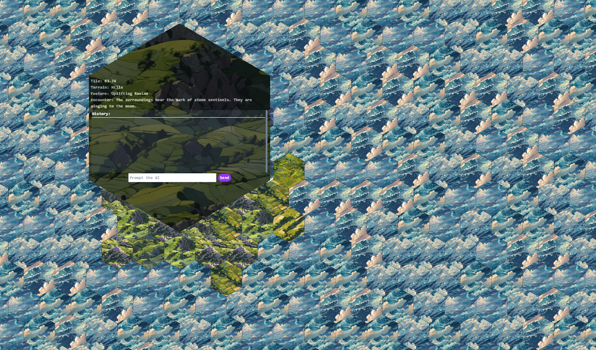

# HEXCHUNKER: A quick DM tool for building hexcrawls!

## Features
Customizable Hexcrawl Generation Tools: Easy to edit python json generators with their own README.

Customizable Rules: Head over to app/api/chat to update the ai generation tools to custom-tailor HEXCHUNKER to your preferences.

Dynamic World Building: Each hex is aware of its adjacent hexes, creating contiguous narratives and stories.

## Tech Stack
HEXCHUNKER is built with the following:

Frontend: The user interface of HEXCHUNKER is handled with NextJS 13

Backend: The backend is powered by NextJS 13

## Getting Started
To get HEXCHUNKER running locally on your machine, please follow the steps below:

1. Clone the repository to your local machine.

2. Install the dependencies by running `npm i` in your terminal at the root directory.

3. Get an api key from Open AI -- https://platform.openai.com/overview *(warning: not free)*

4. Set up an .env file with the necessary environment variables (outlined in env.txt).

5. To generate the chunks, type `npm run generate` in your terminal.

6. To start the development server, type `npm run dev` in your terminal.

7. Visit localhost:3000 in your browser to view the application.

## Contributions
I welcome all kinds of contributions! Please feel free to contribute by opening issues, suggesting features, updating documentation, or even fixing bugs.

## License
HEXCHUNKER is open-source and is licensed under the MIT License.

For any further questions, you can reach out to me directly. Happy coding!

## Other
Due to the inherent costs of running an app like this, I am not at this time interested in deploying this app.
